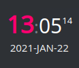
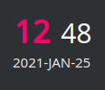
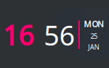
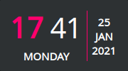
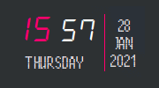

# HTML Clock for Plasma 6

Plasma 6 (KDE) clock widget you can layout and style using just elementary HTML/CSS!

**Get HTML Clock from KDE Store:** https://store.kde.org/p/1473016

> **Note:** Looking for Plasma 5 version? See the [`plasma5` branch](https://github.com/MarcinOrlowski/html-clock-plasmoid/tree/plasma5).

>  Similar look of the above images is just because I quickly crafted them
> using the same markup and colors foundation (plus I use it that way myself :). So worry **not**,
> you are not limited to neither these layouts, nor colors, nor information types shown, as you can
> use [QT's subset of HTML and CSS](https://doc.qt.io/qt-6/richtext-html-subset.html)
> to make yours layout look as **you** like. Please explore the configuration dialog!

## 👉 [See user contributed layout templates!](https://github.com/MarcinOrlowski/html-clock-plasmoid/discussions/categories/html-clock-templates)

______________________________________________________________________

## Table of Contents

- [Configuration](docs/configuration.md)

- [Placeholders](docs/placeholders.md)

- [Tips and tricks](docs/tips.md)

- [Installation and upgrading](docs/installation.md)

- [Changelog](CHANGES.md)

______________________________________________________________________

## License

- Written and copyrighted ©2020-2026 by Marcin Orlowski \<mail (#) marcinorlowski (.) com>
- HTML Clock widget is open-sourced software licensed under
  the [MIT license](http://opensource.org/licenses/MIT)
