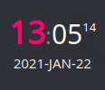
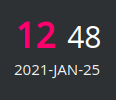
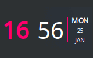
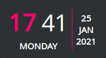
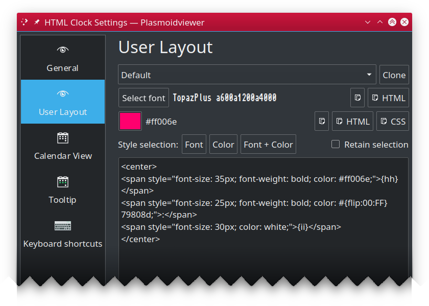

HTML Clock for KDE
==================

Plasma/KDE clock widget you can layout and style using HTML/CSS!







>  Similar look of the above images is just because I quickly crafted them using the same markup and colors
> foundation (plus I use it that way myself :). So worry **not**, you are not limited to neither these layouts, nor colors,
> nor information types shown, as you can use [QT's subset of HTML and CSS](https://doc.qt.io/qt-5/richtext-html-subset.html)
> to make yours layout look as **you** like. Please explore the configuration dialog!

---

## Table of Contents ##

 * [Configuration](#configuration)
   * [General](#general)
   * [User Layout](#user-layout)
   * [Calendar View](#calendar-view)
   * [Tooltip](#tooltip)
 * [Placeholders](#placeholders)
   * [Date and Time](#date-and-time)
   * [Formatting directives](#formatting-directives)
   * [Special placeholders](#special-placeholders)
 * [Tips and tricks](#tips-and-tricks)
   * [Blinking](#blinking)
 * [Installation](#installation)
   * [Using built-in installer](#using-built-in-installer)
   * [Manual installation](#manual-installation)
 * [Upgrading](#upgrading)
 * [Additional resources](#additional-resources)
 * [Changelog](CHANGES.md)
 * [License](#license)

---

## Configuration ##

HTML Clock widget is very flexible and configurable by design. Almost all important aspects of its behavior
can be modified or overriden.

### General ###

This pane allows you to select one of predefined layouts or tell the widget you want to use your own
(defined in "User Layout" pane).


 * **Layout**: selects widget built-in clock layout.
 * **Use user layout**: uses [user layout](#user-layout), instead of built-in one.
 * **Transparent background**: by default, widget uses theme provided background color. When this option is
   checked, widget background is no longer drawn, making it fully transparent. Note: this option is hidden
   on Plasma 5.19 as it introduces similar feature for the all widgets which is preferred.
   option to built-in or newer these version 
 * **Use custom font**: enables use of custom font (and its size) instead of theme default.
   * **Select font**: opends font dialog to select new typeface to use. You can also specify font size.
 * **Locale to use**: By default, the system wide locale settings are used while creating day labels.
   If you want to override this (i.e. have English originated day labels while your whole system uses
   different language, enable this option and put name of locale of your choice (i.e. `pl` or `en_GB`).
   Ensure such locale is available in your system.
 * **Timezone offset**: by default, widget shows your **local** time. But if you want to use different time zone than your
   local, enable this option and provide the offset in form of `[+-]HH:MM`, i.e. `-03:30` or `5:00`. If no sign is specified, positive (`+`) offset is assumed. Faulty offset falls back to `00:00` (which means `GMT` time zone).
 * **Container fill width**: By default clock container takes as much horizontal space as needed to render its content. This may be incorrect behavior if i.e. you use vertical panel and would like to use custom background color. In such case you'd end up having ugly side borders if your clock contant is taking less space than panel's width. To combat this, enable this option to force the widget. **NOTE:** this option is most useful if you use this widget in a dock/panel. For desktop widgets it's recommended to keep
 it off.
 * **Container fill height**: By default clock container takes as much space as needed to render its content. This may be incorrect behavior if i.e. you use horizontal panel and would like to use custom background color. In such case you'd end up having ugly  borders on the top and bottom if your clock contant is taking less vertical space than panel's occupies. To combat this, enable this option to force the widget to take as much vertical space as its parent container allows. **NOTE:** this option is most useful if you use this widget in a dock/panel. For desktop widgets it's recommended to keep
 it off.


### User Layout ###

Aside from using built-in layouts, you can (and probably will) create your own, either completely from scratch
or using one of built-in layouts as your base.



 * **Clone**: Copies the selected built-in layout's markup and parameters to text edit area editor.
 * **Select font**: is part of "font helper" feature. Select any font from installed on your machine and you will see its
   family name shown. Note that name is shown using selected font, so it may not really be readable in case of fonts
   like dingbats.
   * **Copy** Click the "Copy" button to have font family copied to the clipboard (then you can use in text area
   with regular <kbd>CTRL-V</kbd> keyboard paste shortcut).
   * **Copy as HTML**: Clicking this button will put complete HTML snippet using `<span>` styled to use font you
   selected to the clipboard, i.e. `<span style="font-family: Noto Sans; font-size: 16px; font-weight: bold;">Text</span>`.
 * **Select color**: similar to "font helper", it's color helper. Select any color to see its `#RRGGBB` value.
   * **Copy**: Puts your color to the clipboard using `#RRGGBB` notation.
   * **Copy as HTML**: Puts `<span>` styled to use your color to the clipboard, i.e. `<span style="color: #9d7837;">Text</span>`
   * **Copy as CSS**: Puts CSS `color: #RRGGBB;` to the clipboard.
 * **Style selection**: This section allows you to apply font, color (or both) to currently selected part of layout.
   * **Retain selection**: By default selection is clered once style is applied. When this option is checked, selection
     will be retained and updated to cover replaced text.

>  Even if set your font size directly in markup, custom font's size still matters and influences
> the whole layout, affecting i.e. default spacing between elements. If you are trying to make your layout compact,
> it's recommended to select custom font size to `1` and set the text size using i.e. CSS.

### Calendar View ###

Configures built-in calendar view, shown (by default) when you tap on the widget.


 * **Enabled calendar view**: uncheck to disable calendar view popup from showing up on widget click.
 * **Show week numbers**: specifies if popup calendar view should also show week numbers.

---

### Tooltip ###

Configures widget tooltip information, shown when you hoover over the widget.


 * **Main text**: template for main tooltip text line.
 * **Sub text**: template for tooltip subtext line.

---

## Placeholders ##

Both HTML layout or tooltip string can contain anything you like, however certain sequences are considered
placeholders, and will be replaced by corresponding values, all other elements are returned unaltered.

### Date and Time ###

These are date and time related, and will return values based on your current calendar/clock and system timezone settings.

| Placeholder | Description |
|-------------|-------------|
| {yy} 		| long year (i.e. "2009") |
| {y} 		| short year (i.e. "09") |
| {MMM}	    | long month name (i.e. "January") |
| {MM}		| abbreviated (locale based) month name (i.e. "Jan") |
| {M}		| first letter of month name (i.e. "J") |
| {mm}		| zero prefixed 2 digit month number ("02" for Feb, "12" for Dec) |
| {m}		| month number as is ("2" for Feb, "12" for Dec) |
| {DDD}	    | full day name (i.e. ""Saturday", "Sunday", "Monday") |
| {DD}		| abbreviated (locale based) day name ("Sat", "Sun", "Mon") |
| {D}		| one letter day name ("S", "S", "M") |
| {dd}		| zero prefixed 2 digit day number ("01", "27") |
| {d}		| day number as is ("1", "27") |
| {hh}		| current hour, zero prefixed, 24hrs clock (i.e. "01", "16") |
| {h}		| current hour, 24hrs clock (i.e. "1", "16") |
| {kk}		| current hour, zero prefixed, 12hrs clock (i.e. "01", "11") |
|  {k}		| current hour, 12hrs clock (i.e. "1", "11") |
| {ii}		| current minute, zero prefixed (i.e. "01", "35") |
| {i}		| current minute (i.e. "1", "35") |
| {ss}		| current second, zero prefixed (i.e. "01", "35") <sup>v1.1.0+</sup>|
| {s}		| current second (i.e. "1", "35") <sup>v1.1.0+</sup>|
| {AA}		| upper-cased AM/PM marker (i.e. "AM") |
| {A}		| upper-cased abbreviated AM/PM marker. "A" for "AM", "P" for "PM" |
| {aa}		| lower-cased am/pm marker (i.e. "am") |
| {a}		| lower-cased abbreviated AM/PM marker. "a" for "am", "p" for "pm" |
| {Aa}		| AM/PM marker with first letter uppercased (i.e. "Am"/"Pm") |
| {t}		| Timezone name (i.e. "UTC")
| {ldl}		| Locale based date long format <sup>v1.1.0+</sup>|
| {lds}		| Locale based date short format <sup>v1.1.0+</sup>|
| {ltl}		| Locale based time long format <sup>v1.1.0+</sup>|
| {lts}		| Locale based time short format <sup>v1.1.0+</sup>|
| {ldtl}	| Locale based date and time long format <sup>v1.1.0+</sup>|
| {ldts}	| Locale based date and time short format <sup>v1.1.0+</sup>|

 For example, `Today is {DDD}` will produce `Today is Sunday` (assuming today is named "Sunday").

### Formatting directives ###

 You can also use optional formatting directives. The syntax is `{PLACEHOLDER:DIRECTIVE}`
 and supported directives are:

| Directive | Description |
|-------------|-------------|
| U | Turns whole placeholder uppercased (i.e. "{DD:U}" => "SAT") |
| L | Turns whole placeholder lowercased (i.e. "{DD:L}" => "sat") |
| u | Turns first letter of placeholder uppercased, leaving remaining part unaltered. This is useful when i.e. weekday or month names are usually lowercased in your language but you'd like to have it other way. I.e. for Polish localization, "{DDD}" can produce "wtorek" for Tuesday. With "{DDD:u}" you would get "Wtorek" instead. |
| 00 | Ensures placeholder value is at last two **characters** (not just digits!) long by adding leading zeros to shorter strings. Longer strings will not be trimmed. Also note zeroes will be prepended unconditionally, even if that would make no much sense, i.e. `{D:00}` produce `0M` on Mondays. |

>  **NOTE:** at the moment, formatting directives cannot be combined.

### Special placeholders ###

These are extra placeholders that are implemented to work around limitation of QT's supported HTML/CSS.

| Placeholder | Description |
|-------------|-------------|
| {flip:XX:YY} 		| Will be replaced by value given as `XX` for every even second and with value specified as `YY` for every odd second. This can be used to do some animation or other [tricks](#tips-and-tricks). Both `XX` and `YY` can be almost any text you want and can be used in any place of your layout, so you can flip **parts** of your CSS style, HTML markup or **even flip other placeholders**, as `{flip}` is always processed separately as first one. |

>  **LIMITATIONS:** There is one, but bold. Use of `:` as part of flipped value is
> currently not supported and will cause odd effects if tried. This unfortunately got further implications
> and affects the following functionality:
>
>  * `{flip}` can't be nested into other `{flip}`,
>  * while you can use other placeholders as `{flip}` arguments, they must not use [formatting modifiers](#formatting-directives),
>  * you cannot flip HTML markup with embedded CSS due to `:` being CSS separator. You can flip part of CSS separately though.

---

## Tips and tricks ##

QT support for HTML and CSS is not covering all features available, so here are some tricks you
can pull to achieve effects offten desired while creating new clock.

### Blinking ###

Blinking seconds (usually shown in a form of blinking `:` separator placed between hours and minutes.
Unfortunately we cannot use CSS animators here as these are not supported by QT implementation. But we can do some
smart tricks with text colors, as fortunately for us, QT supports CSS colors as well as its alpha channel (aka
transparency). So to make thing blink, we will be simply cycling between fully transparent and fully opaque
every second. To achieve that effect, you need to use special placeholder called `{flip:XX:YY}`, which is simply
replaced by `XX` on every even second, and by `YY` on every odd second. 

#### Examples ####

Knowing that CSS color format is `#AARRGGBB` where `AA` is alpha channel value from `00` being fully transparent
to `FF` (255 in decimal) being fully opaque, we can do this:

```html
<span style="color: #{flip:00:FF}ffffff;">BLINK!</span>
```


But if you want, you can also blink by toggling whole colors:

```html
<span style="color: {flip:#ff0000:#00ff00};">BLINK!</span>
<span style="color: {flip:red:green};">BLINK!</span>
```

or by using [QT supported SVG color names](https://doc.qt.io/qt-5/qml-color.html#svg-color-reference):

```html
<span style="color: {flip:red:green};">BLINK!</span>
```

You can use `{flip}` as many times as you want, so you can easily achieve this:

```html
<span style="color: {flip:#ff0000:green};">{flip:THIS:BLINKS}!</span>
```


As already mentioned, you can also flip other placeholders:

```html
{flip:{MMM} {dd}, {yyyy}:Today is {DDD}}
```


---

## Installation ##

You should be able to install HTML Clock widget either using built-in Plasma Add-on installer
or manually, by downloading `*.plasmoid` file either from project
[Github repository](https://github.com/MarcinOrlowski/html-clock-plasmoid/) or
from [KDE Store](https://www.pling.com/p/1473016/)

### Using built-in installer ###

To install widget using Plasma built-in mechanism, press right mouse button over your desktop
or panel and select "Add Widgets..." from the context menu, then "Get new widgets..." eventually
choosing "Download New Plasma Widgets...". Then search for "HTML Clock" in "Plasma Add-On Installer" window.


### Manual installation ###

Download `*.plasmoid` file from [project Release section](https://github.com/MarcinOrlowski/html-clock-plasmoid/releases).
Then you can either install it via Plasmashell's GUI, by clicking right mouse button over your desktop or panel and
selecting "Add widgets...", then "Get new widgets..." eventually choosing "Install from local file..." and pointing to downloaded
`*.plasmoid` file.

Alternatively you can install it using your terminal, with help of `kpackagetool5`:

```bash
kpackagetool5 --install /PATH/TO/DOWNLOADED/htmlclock.plasmoid 
```

## Upgrading ##

If you already have widget running and there's newer release your want to install, use `kpackagetool5`
with `--upgrade` option. This will update current installation while keeping your settings intact:

```bash
kpackagetool5 --upgrade /PATH/TO/DOWNLOADED/htmlclock.plasmoid
```

**NOTE:** Sometimes, due to Plasma internals, newly installed version may not be instantly seen working,
so you may want to convince Plasma by doing manual reload (this will **NOT** log you out nor affect
other apps):

```bash
kquitapp5 plasmashell ; kstart5 plasmashell
```

---

## Additional resources ##

 * [HTML Clock widget in KDE store](https://www.pling.com/p/1473016/)
 * [Plasmoid developer helper tools](https://github.com/marcinorlowski/plasmoid-tools)

---

## License ##

 * Written and copyrighted &copy;2020-2021 by Marcin Orlowski <mail (#) marcinorlowski (.) com>
 * Weekday Grid widget is open-sourced software licensed under the [MIT license](http://opensource.org/licenses/MIT)

