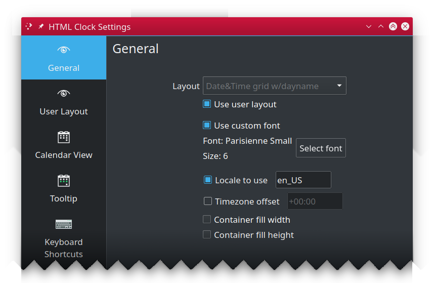
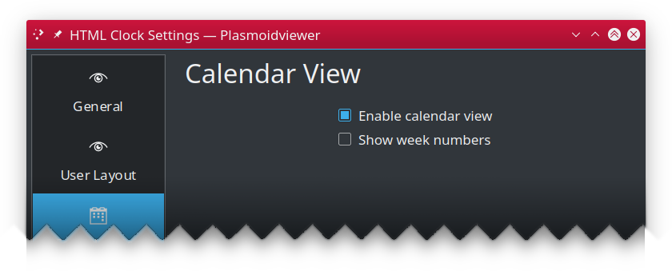

HTML Clock for KDE
==================

Plasma/KDE clock widget, stylable with QT provided subset of HTML

For list of supported HTML tags [click here](https://doc.qt.io/qt-5/richtext-html-subset.html).

---

## Table of Contents ##

 * [Configuration](#configuration)
   * [General](#general)
   * [User Layout](#user-layout)
   * [Calendar View](#calendar-view)
   * [Tooltip](#tooltip)
 * [Placeholders](#placeholders)
 * [Installation](#installation)
   * [Using built-in installer](#using-built-in-installer)
   * [Manual installation](#manual-installation)
 * [Upgrading](#upgrading)
 * [Additional resources](#additional-resources)
 * [Changelog](CHANGES.md)
 * [License](#license)

---

## Configuration ##

HTML Clock widget is very flexible and configurable by design. Almost all important spects of its behavior
can be modified to fit your needs.

### General ###

Allows you to select one of predefined layouts or use custom one, as defined in "User Layout" pane.

 * **Layout**: selects widget built-in clock layout.
 * **Use user layout**: uses [user layout](#user-layout), instead of built-in one.
 * **Locale to use**: By default, the system wide locale settings are used while creating day labels.
   If you want to override this (i.e. have English originated day labels while your whole system uses
   different language, enable this option and put name of locale of your choice (i.e. `pl` or `en_GB`).
   Ensure such locale is available in your system.

### User Layout ###

Aside from using built-in layouts, you can create your own, either from scratch, or using any of built-in
layouts as starting point.

 * **Clone**: Copies markup of selected built-in layout to text edit area editor.
 * **Base font pixel size**: Defines pixel font size used for widget texts for elements font size is not specified elsewehere (i.e. CSS).

### Calendar View ###

Configures built-in calendar view, shown (by default) on widget tap.

 * **Enabled calendar view**: uncheck to disable calendar view popup from showing up on widget click.
 * **Show week numbers**: specifies if popup calendar view should also show week numbers.

---

### Tooltip ###

Configures widget tooltip information, shown when you hoover over the widget.

 * **Main text**: template for main tooltip text line.
 * **Sub text**: template for tooltip subtext line.

---

## Placeholders ##

 Both HTML layout or tooltip string can contain anything you like, however certain sequences are considered
 placeholders, and will be replaced by corresponding values. Non-placeholders are returned
 unprocessed.

| Placeholder | Description |
|-------------|-------------|
| {yy} 		| long year (i.e. "2009") |
| {y} 		| short year (i.e. "09") |
| {MMM}	    | long month name (i.e. "January") |
| {MM}		| abbreviated month name (i.e. "Jan") |
| {M}		| first letter of month name (i.e. "J") |
| {mm}		| zero prefixed 2 digit month number ("02" for Feb, "12" for Dec) |
| {m}		| month number as is ("2" for Feb, "12" for Dec) |
| {DDD}	    | full day name (i.e. ""Saturday", "Sunday", "Monday") |
| {DD}		| abbreviated day name ("Sat", "Sun", "Mon") |
| {D}		| one letter day name ("S", "S", "M") |
| {dd}		| zero prefixed 2 digit day number ("01", "27") |
| {d}		| day number as is ("1", "27") |
| {hh}		| current hour, zero prefixed, 24hrs clock (i.e. "01", "16") |
| {h}		| current hour, 24hrs clock (i.e. "1", "16") |
| {kk}		| current hour, zero prefixed, 12hrs clock (i.e. "01", "11") |
| {k}		| current hour, 12hrs clock (i.e. "1", "11") |
| {ii}		| current minute, zero prefixed (i.e. "01", "35") |
| {i}		| current minute (i.e. "1", "35") |
| {ss}		| current second, zero prefixed (i.e. "01", "35") v1.1.0+|
| {s}		| current second (i.e. "1", "35") v1.1.0+|
| {AA}		| upper-cased AM/PM marker (i.e. "AM") |
| {A}		| upper-cased abbreviated AM/PM marker. "A" for "AM", "P" for "PM" |
| {aa}		| lower-cased am/pm marker (i.e. "am") |
| {a}		| lower-cased abbreviated AM/PM marker. "a" for "am", "p" for "pm" |
| {Aa}		| AM/PM marker with first letter uppercased (i.e. "Am"/"Pm") |
| {t}		| Timezone name (i.e. "UTC")
| {ldl}		| Locale based date long format v1.1.0+|
| {lds}		| Locale based date short format v1.1.0+|
| {ltl}		| Locale based time long format v1.1.0+|
| {lts}		| Locale based time short format v1.1.0+|
| {ldtl}	| Locale based date and time long format v1.1.0+|
| {ldts}	| Locale based date and time short format v1.1.0+|

---

## Installation ##

You should be able to install HTML Clock widget either using built-in Plasma Add-on installer
or manually, by downloading `*.plasmoid` file either from project
[Github repository](https://github.com/MarcinOrlowski/html-clock-plasmoid/) or
from [KDE Store](https://www.pling.com/p/1473016/)

### Using built-in installer ###

To install widget using Plasma built-in mechanism, press right mouse button over your desktop
or panel and select "Add Widgets..." from the context menu, then "Get new widgets..." eventually
choosing "Download New Plasma Widgets...". Then search for "HTML Clock" in "Plasma Add-On Installer" window.

### Manual installation ###

Download `*.plasmoid` file from [project Release section](https://github.com/MarcinOrlowski/html-clock-plasmoid/releases).
Then you can either install it via Plasmashell's GUI, by clicking right mouse button over your desktop or panel and
selecting "Add widgets...", then "Get new widgets..." eventually choosing "Install from local file..." and pointing to downloaded
`*.plasmoid` file.

Alternatively you can install it using your terminal, with help of `kpackagetool5`:

    kpackagetool5 --install /PATH/TO/DOWNLOADED/htmlclock.plasmoid 

## Upgrading ##

If you already have widget running and there's newer release your want to install, use `kpackagetool5`
with `--upgrade` option. This will update current installation while keeping your settings intact:

    kpackagetool5 --upgrade /PATH/TO/DOWNLOADED/htmlclock.plasmoid

**NOTE:** Sometimes, due to Plasma internals, newly installed version may not be instantly seen working,
so you may want to convince Plasma by doing manual reload:

    kquitapp5 plasmashell ; kstart5 plasmashell

**NOTE:** this will **NOT** log you out nor affects any other apps. 

---

## Additional resources ##

 * [HTML Clock widget in KDE store](https://www.pling.com/p/1473016/)
 * [Plasmoid developer helper tools](https://github.com/marcinorlowski/plasmoid-tools)

---

## License ##

 * Written and copyrighted &copy;2020-2021 by Marcin Orlowski <mail (#) marcinorlowski (.) com>
 * Weekday Grid widget is open-sourced software licensed under the [MIT license](http://opensource.org/licenses/MIT)

