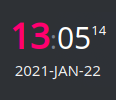
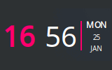

---

# HTML Clock for Plasma 6 #

Plasma 6 (KDE) clock widget you can layout and style using just elementary HTML/CSS!

> **Note:** Looking for legacy Plasma 5 version for any reason? 
> See the [`plasma5` branch](https://github.com/MarcinOrlowski/html-clock-plasmoid/tree/plasma5), 
> or the v1.x releases in general.

>  Similar look of the above images is just because I quickly crafted them
> using the same markup and colors foundation (plus I use it that way myself :). So worry **not**,
> you are not limited to neither these layouts, nor colors, nor information types shown, as you can
> use [QT's subset of HTML and CSS](https://doc.qt.io/qt-6/richtext-html-subset.html)
> to make yours layout look as **you** like. Please explore the configuration dialog!

---

## Table of Contents ##

* [Configuration](configuration.md)
* [Placeholders](placeholders.md)
* [Tips and tricks](tips.md)
* [Installation and upgrading](installation.md)
* [Translation guide](translation.md)

* [User contributed layouts!](https://github.com/MarcinOrlowski/html-clock-plasmoid/discussions/categories/html-clock-templates) ##

* [Changelog](../CHANGES.md)

---

## Additional resources ##

* [HTML Clock widget in KDE store](https://www.pling.com/p/1473016/)
* [Plasmoid developer helper tools](https://github.com/marcinorlowski/plasmoid-tools)

## License ##

* Written and copyrighted &copy;2020-2026 by Marcin Orlowski <mail (#) marcinorlowski (.) com>
* HTML Clock widget is open-sourced software licensed under
  the [MIT license](http://opensource.org/licenses/MIT)
