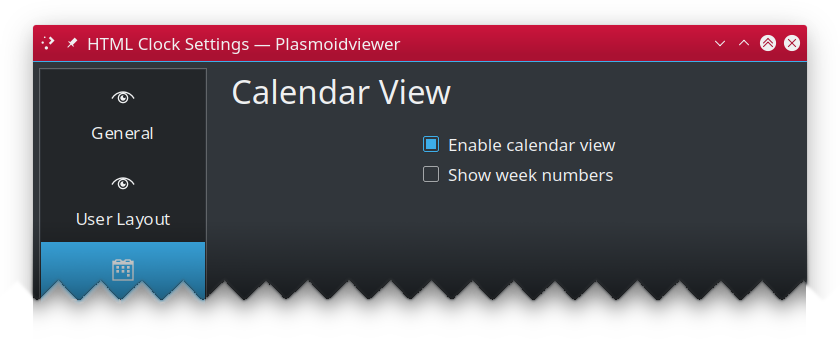

---

## Table of Contents ##

* [Configuration](configuration.md)
  * [General](#general)
  * [User Layout 1/2/3](#user-layout)
  * [Calendar View](#calendar-view)
  * [Tooltip](#tooltip)
* [Placeholders](placeholders.md)
* [Tips and tricks](tips.md)
* [Installation and upgrading](installation.md)

---

## Configuration ##

HTML Clock widget is very flexible and configurable by design. Almost all important aspects of its
behavior can be modified or overridden.

### General ###

This pane allows you to select one of predefined layouts or tell the widget you want to use your own
(defined in "User Layout" pane).

* **Layout**: selects widget built-in clock layout. A live preview below the selector shows how the
  selected layout will look. The preview updates in real-time, including animated effects like
  blinking colons (using the `{cycle}` placeholder).
* **Use user layout**: uses [user layout](#user-layout), instead of built-in one. When enabled,
  a slot selector appears allowing you to choose which of the 3 user layout slots to display.
* **{cycle} interval**: controls how fast the `{cycle}` placeholder cycles through its values.
  Default is 1000ms (1 second). Lower values make the animation faster.
* **{random} interval**: controls how often the `{random}` placeholder picks a new random value.
  Default is 1000ms (1 second).
* **Use custom font**: enables use of custom font (and its size) instead of theme default.
  * **Select font**: opens font dialog to select new typeface to use. You can also specify font
    size.
* **Locale to use**: By default, the system wide locale settings are used while creating day labels.
  If you want to override this (i.e. have English originated day labels while your whole system uses
  different language, enable this option and put name of locale of your choice (i.e. `pl` or
  `en_GB`). Ensure such locale is available in your
  system.
* **Timezone offset**: by default, widget shows your **local** time. But if you want to use
  different time zone than your local, enable this option and provide the offset in form of
  `[+-]HH:MM`, i.e. `-03:30` or `5:00`. If no sign is specified, positive (`+`) offset is assumed.
  Faulty offset falls back to `00:00` (which means `GMT` time zone).
* **Container fill width**: By default clock container takes as much horizontal space as needed to
  render its content. This may be incorrect behavior if i.e. you use vertical panel and would like
  to use custom background color. In such case you'd end up having ugly side borders if your clock
  content is taking less space than panel's width. To combat this, enable this option to force the
  widget. **NOTE:** this option is most useful if you use this widget in a dock/panel. For desktop
  widgets it's recommended to keep
  it off.
* **Container fill height**: By default clock container takes as much space as needed to render its
  content. This may be incorrect behavior if i.e. you use horizontal panel and would like to use
  custom background color. In such case you'd end up having ugly borders on the top and bottom if
  your clock content is taking less vertical space than panel's occupies. To combat this, enable
  this option to force the widget to take as much vertical space as its parent container allows. *
  *NOTE:** this option is most useful if you use this widget in a dock/panel. For desktop widgets
  it's recommended to keep it off.

### User Layout ###

Aside from using built-in layouts, you can (and probably will) create your own, either completely
from scratch or using one of built-in layouts as your base.

The widget provides **3 user layout slots** (User Layout 1, 2, and 3), allowing you to experiment
with different designs and easily switch between them or rollback to a previous working layout.

A **live preview** above the text editor shows how your layout will render in real-time as you type.
The preview displays the current time with all placeholders resolved, and animates any `{cycle}`
and `{random}` effects so you can see exactly how your clock will look.

* **Clone**: Copies the selected built-in layout's markup and parameters to text edit area editor.
* **Select font**: is part of "font helper" feature. Select any font from installed on your machine
  and you will see its family name shown. Note that name is shown using selected font, so it may not
  really be readable in case of fonts
  like dingbats.
  * **Copy** Click the "Copy" button to have font family copied to the clipboard (then you can use
    in text area with regular <kbd>CTRL-V</kbd> keyboard paste shortcut).
  * **Copy as HTML**: Clicking this button will put complete HTML snippet using `` styled to
    use font you selected to the clipboard, i.e.
    `Text`.
* **Select color**: similar to "font helper", it's color helper. Select any color to see its
  `#RRGGBB` value.
  * **Copy**: Puts your color to the clipboard using `#RRGGBB` notation.
  * **Copy as HTML**: Puts `` styled to use your color to the clipboard, i.e.
    `Text`
  * **Copy as CSS**: Puts CSS `color: #RRGGBB;` to the clipboard.
* **Style selection**: This section allows you to apply font, color (or both) to currently selected
  part of layout.
  * **Retain selection**: By default selection is clered once style is applied. When this option is
    checked, selection will be retained and updated to cover replaced text.

>  Even if set your font size directly in markup, custom font's size
> still matters and influences the whole layout, affecting i.e. default spacing between elements.
> If you are trying to make your layout compact, it's recommended to select custom font size to `1`
> and set the text size using i.e. CSS.

### Calendar View ###

Configures built-in calendar view, shown (by default) when you tap on the widget.

* **Enabled calendar view**: uncheck to disable calendar view popup from showing up on widget click.
* **Show week numbers**: specifies if popup calendar view should also show week numbers.

---

### Tooltip ###

Configures widget tooltip information, shown when you hover over the widget.

* **Main text**: template for main tooltip text line.
* **Sub text**: template for tooltip subtext line.
