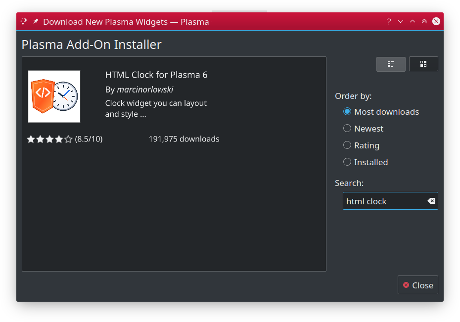

---

## Table of Contents ##

* [Configuration](configuration.md)
* [Placeholders](placeholders.md)
* [Tips and tricks](tips.md)
* [Installation and upgrading](installation.md)
  * [Using built-in installer](#using-built-in-installer)
  * [Manual installation](#manual-installation)
  * [Upgrading](#upgrading)

---

## Installation ##

You should be able to install HTML Clock widget either using built-in Plasma Add-on installer
or manually, by downloading `*.plasmoid` file either from project
[Github repository](https://github.com/MarcinOrlowski/html-clock-plasmoid/) or
from [KDE Store](https://www.pling.com/p/1473016/)

### Using built-in installer ###

To install widget using Plasma built-in mechanism, press right mouse button over your desktop
or panel and select "Add Widgets..." from the context menu, then "Get new widgets..." eventually
choosing "Download New Plasma Widgets...". Then search for "HTML Clock" in "Plasma Add-On Installer"
window.



### Manual installation ###

Download `*.plasmoid` file
from [project Release section](https://github.com/MarcinOrlowski/html-clock-plasmoid/releases).
Then you can either install it via Plasmashell's GUI, by clicking right mouse button over your
desktop or panel and selecting "Add widgets...", then "Get new widgets..." eventually choosing "
Install from local file..." and pointing to downloaded `*.plasmoid` file.

Alternatively you can install it using your terminal, with help of `kpackagetool6`:

```bash
kpackagetool6 --install /PATH/TO/DOWNLOADED/htmlclock.plasmoid 
```

## Upgrading ##

If you already have widget running and there's newer release your want to install, use
`kpackagetool6` with `--upgrade` option. This will update current installation while keeping your
settings intact:

```bash
kpackagetool6 --upgrade /PATH/TO/DOWNLOADED/htmlclock.plasmoid
```

**NOTE:** Sometimes, due to Plasma internals, newly installed version may not be instantly seen
working, so you may want to convince Plasma by doing manual reload (this will **NOT** log you out
nor affect other apps):

```bash
kquitapp6 plasmashell && kstart plasmashell
```
