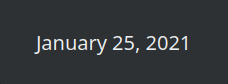

---

## Table of Contents ##

* [Configuration](configuration.md)
* [Placeholders](placeholders.md)
* [Tips and tricks](tips.md)
  * [Blinking](#blinking)
  * [Fixed width](#fixed-width)
* [Installation and upgrading](installation.md)

---

## Tips and tricks ##

* QT support for HTML and CSS is not covering all features available, so here are some tricks you
  can pull to achieve effects often desired while creating new clock.
* Want custom background color for your widget? Just ensure your template uses `<body>` tag and set
  its  `bgcolor` as you like. Remember that you also need to enable either `Container fill width` or
  `Container fill height` depending on your desired orientation.
* Do not try to set the widget width with `width` on `<body>` or `<div>`, nor with the CSS `width`
  property. QT ignores all three. See [Fixed width](#fixed-width) for what does work.

### Blinking ###

Blinking seconds (usually shown in a form of blinking `:` separator placed between hours and
minutes. Unfortunately we cannot use CSS animators here as these are not supported by QT
implementation. But we can do some smart tricks with text colors, as fortunately for us, QT supports
CSS colors as well as its alpha channel (aka transparency). So to make thing blink, we will be
simply cycling between fully transparent and fully opaque every second. To achieve that effect, you
need to use special placeholder called `{cycle|XX|YY}`, which is simply replaced by `XX` on every
even second, and by `YY` on every odd second.

#### Examples ####

Knowing that CSS color format is `#AARRGGBB` where `AA` is alpha channel value from `00` being fully
transparent to `FF` (255 in decimal) being fully opaque, we can do this:

```html
<span style="color: #{cycle|00|FF}ffffff;">BLINK!</span>
```


But if you want, you can also blink by toggling whole colors:

```html
<span style="color: {cycle|#ff0000|#00ff00};">BLINK!</span>
<span style="color: {cycle|red|green};">BLINK!</span>
```

or by
using [QT supported SVG color names](https://doc.qt.io/qt-6/qml-color.html#svg-color-reference):

```html
<span style="color: {cycle|red|green};">BLINK!</span>
```

You can use `{cycle}` as many times as you want, so you can easily achieve this:

```html
<span style="color: {cycle|#ff0000|green};">{cycle|THIS|BLINKS}!</span>
```


As already mentioned, you can also cycle other placeholders:

```html
{cycle|{MMM} {dd}, {yyyy}|Today is {DDD}}
```



### Fixed width ###

The widget is as wide as the HTML it renders, so `{cycle}` or `{random}` values of different
lengths make it grow and shrink on every tick, which in a panel keeps pushing the neighbouring
widgets aside. A clock wider than the panel is thick could also overlap them.

The widget handles this for you, with no option to set: it measures every value your layout can
show and never becomes narrower than the widest one, so its size stops changing. It grows again if
a value nobody could predict shows up (i.e. a longer month name), and it is measured anew whenever
you change the layout, the font or the locale. In a vertical panel the height is kept steady
instead of the width, as there the width belongs to the panel.

If you want an exact width instead, use `Minimum width` and `Maximum width`, both described in
[Configuration](configuration.md#general).

You can also pin the width in your markup. QT's rich text engine is not a browser, and it supports
`width` on **tables only**. These three do **nothing at all**, no matter what value you give them:

```html
<div style="width: 200px;">…</div>   <!-- ignored: CSS width -->
<div width="200">…</div>             <!-- ignored: width on a div -->
<body width="100%">…</body>          <!-- ignored: width on the body -->
```

So if you want a width in the layout itself, a `<table>` is the way to go. Use the `width`
**attribute** (not CSS) on `<table>` or on `<td>`:

```html
<table width="200" cellpadding="0" cellspacing="0" border="0">
  <tr><td align="center">{cycle|{d} {MM} {yyyy} ({DD})|{dy}/365}</td></tr>
</table>
```

Two things to know about it:

* It is a minimum, not a limit. Content wider than the given value makes the table grow.
* The value is in pixels. A percentage has nothing to be a percentage of, because the widget is as
  wide as its own content.
